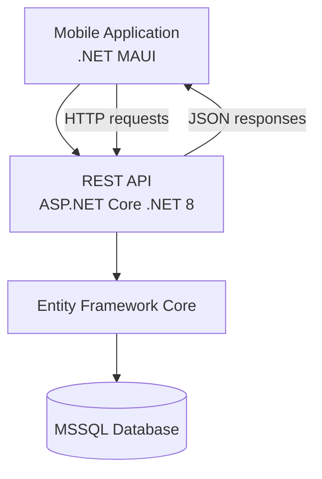

# FitApp API

Backend REST API for the **FitApp fitness tracking application**.  
The API manages users, daily reports, meals and hydration tracking.

The application allows users to track calories, macronutrients and water intake on a daily basis.

---

# Tech stack

- ASP.NET Core (.NET 8)
- Entity Framework Core
- MSSQL
- REST API
- EF Core Migrations

---

# Features

- user registration and login
- creating daily reports
- adding meals to daily reports
- automatic calorie and macronutrient calculation
- hydration tracking
- meal search
- editing daily nutrition data

---

# API Structure

Main controllers implemented in the project:

### UserController

Handles user authentication and user management.

Endpoints include:
```
- GET /api/user
- GET /api/user/{id}
- GET /api/user/by-name/{name}
- GET /api/user/by-mail/{mail}
- POST /api/user/register
- POST /api/user/login
- PUT /api/user/{id}
- PUT /api/user/{id}/weight
- DELETE /api/user/{id}
```

---

### MealController

Handles meals stored in the system.

Endpoints include:
```
- GET /api/Meal
- GET /api/Meal/id?id={id}
- GET /api/Meal/by-name/{name}
- POST /api/Meal
- PUT /api/Meal/id?id={id}
- DELETE /api/Meal/{id}
```
This controller calculates daily calories and macronutrients based on meal entries. :contentReference[oaicite:0]{index=0}

---

### DailyController

Handles daily reports for users.
```
Endpoints include:
- GET /api/daily
- GET /api/daily/user/{userId}
- GET /api/daily/user/{userId}/date/{date}
- POST /api/daily
- PUT /api/daily/{id}
- PUT /api/daily/{id}/water
- DELETE /api/daily/{id}
```
---

### MealEntryController

Each meal entry updates the total nutritional values of the daily report.

Endpoints include:
```
- GET /api/mealentry
- GET /api/mealentry/daily/{dailyId}
- GET /api/mealentry/{id}
- POST /api/mealentry
- PUT /api/mealentry/{id}
- DELETE /api/mealentry/{id}
```
---

# Running the project locally

Because the Azure deployment used during development has been disabled, the application must be run locally.

### Requirements

- .NET 8 SDK
- Microsoft SQL Server
- Visual Studio or VS Code

### Steps

1. Clone repository
```
git clone https://github.com/Jeendzaa/FitApp
```
2. Configure database connection in
```
appsettings.json
```
Example:
```
"ConnectionStrings": {
"DefaultConnection": "Server=YOUR_SERVER;Database=FitAppDb;Trusted_Connection=True;"
}
```
3. Create empty database.
4. Run migrations
```
dotnet ef database update
```
5. Run the API
```
dotnet run
```
API will start locally, usually on:
```
https://localhost:5001
```
---

# Project purpose

This project was developed as part of an **engineering thesis project** focused on building a full-stack application consisting of:

- REST API backend
- mobile application client
- relational database

---

## Architecture


